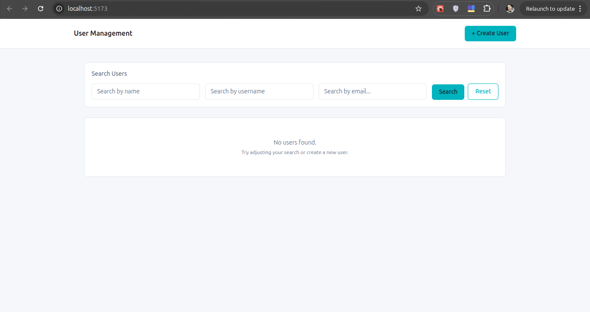
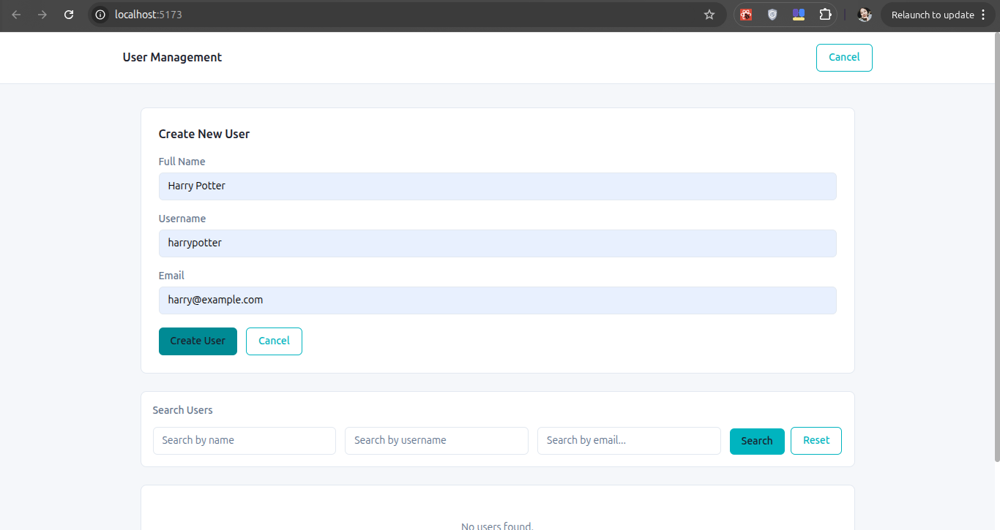
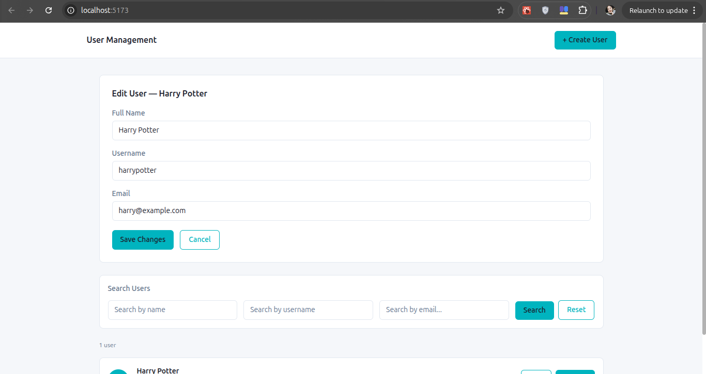
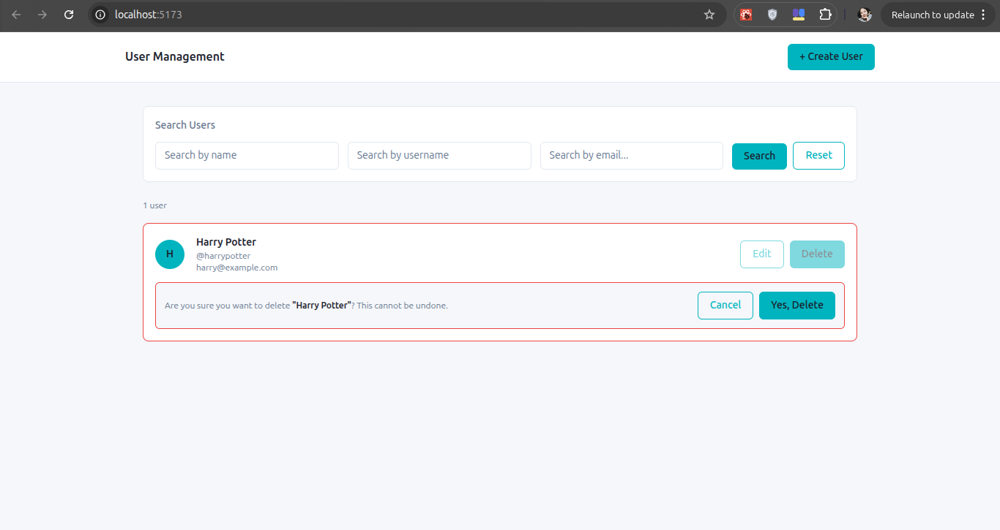
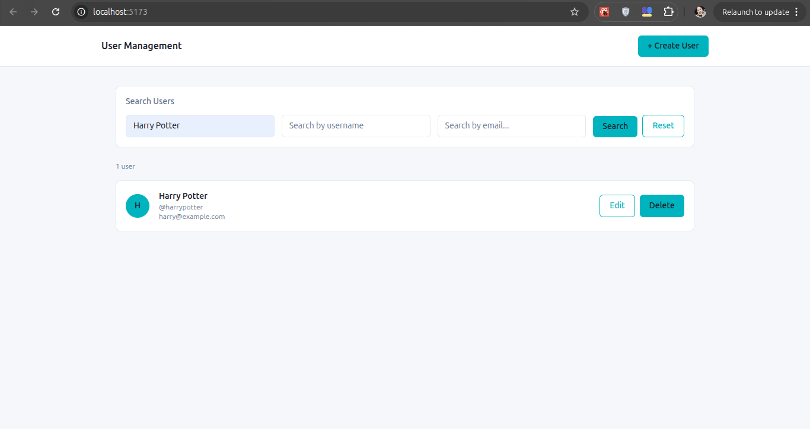
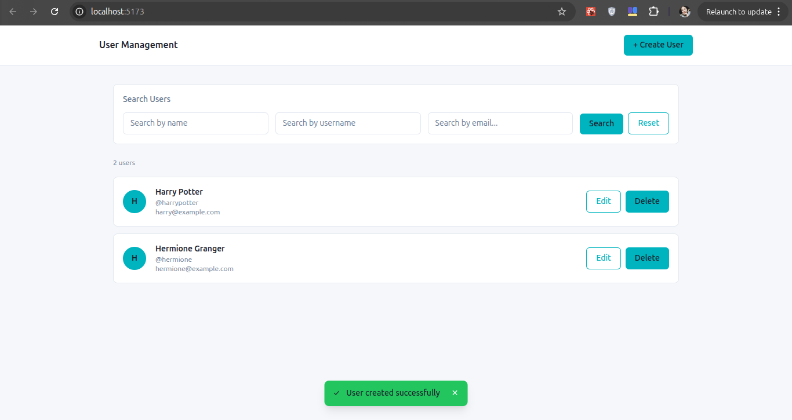
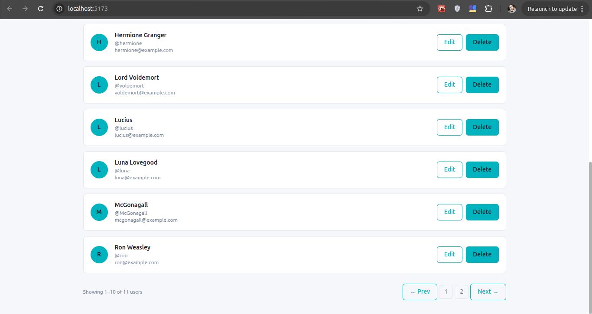

# User Management Dashboard

A full-stack User Management Dashboard built with **React + TypeScript** (frontend) and **Node.js + Express + TypeScript** (backend). Data is stored in a JSON file instead of a database.

---

## Screenshots

| Dashboard | Create User |
|-----------|-------------|
|  |  |

| Edit User | Delete Confirm |
|-----------|----------------|
|  |  |

| Search | Toast Notification |
|--------|--------------------|
|  |  |

|Pagination|
|----------|
| 
---

## Tech Stack

### Backend
| Technology | Purpose |
|------------|---------|
| Node.js + Express | REST API server |
| TypeScript | Type safety |
| Zod | Request validation |
| fs/promises | JSON file I/O |
| uuid (crypto) | UUID generation |
| helmet | Security headers |
| cors | Cross-origin requests |
| dotenv | Environment variables |

### Frontend
| Technology | Purpose |
|------------|---------|
| React 19 | UI framework |
| TypeScript | Type safety |
| Vite | Build tool |
| Tailwind CSS v4 | Styling |
| Axios | HTTP client |

---

## Project Structure

```
user-management-dashboard/
├── backend/
│   ├── data/
│   │   └── users.json              # JSON data store
│   ├── src/
│   │   ├── middlewares/
│   │   │   ├── errorHandler.ts     # Global error handler
│   │   │   └── validator.ts        # Zod validation middleware
│   │   ├── modules/
│   │   │   └── users/
│   │   │       ├── user.controller.ts
│   │   │       ├── user.routes.ts
│   │   │       ├── user.schema.ts
│   │   │       └── user.service.ts
│   │   ├── types/
│   │   │   └── user.types.ts
│   │   ├── utils/
│   │   │   ├── AppError.ts
│   │   │   ├── fileHelper.ts
│   │   │   └── response.ts
│   │   ├── helper/
│   │   │   ├── pagination.schema.ts
│   │   │   └── paginationHelper.ts
│   │   ├── app.ts
│   │   └── server.ts
│   ├── .env.example
│   ├── package.json
│   └── tsconfig.json
│
├── frontend/
│   ├── src/
│   │   ├── components/
│   │   │   ├── ui/
│   │   │   │   ├── Button.tsx
│   │   │   │   ├── Input.tsx
│   │   │   │   └── Toast.tsx
│   │   │   ├── Pagination.tsx
│   │   │   ├── SearchBar.tsx
│   │   │   ├── UserCard.tsx
│   │   │   ├── UserForm.tsx
│   │   │   └── UserList.tsx
│   │   ├── hooks/
│   │   │   ├── useDashboard.ts
│   │   │   ├── useToast.ts
│   │   │   └── useUsers.ts
│   │   ├── services/
│   │   │   └── userService.ts
│   │   ├── types/
│   │   │   └── user.types.ts
│   │   ├── utils/
│   │   │   ├── httpClient.ts
│   │   │   └── theme.ts
│   │   ├── App.tsx
│   │   └── main.tsx
│   ├── .env.example
│   ├── package.json
│   └── vite.config.ts
│
└── README.md
```

---

## API Endpoints

### Base URL
```
http://localhost:5000/api
```

### Users

| Method | Endpoint | Description | Request Body | Response |
|--------|----------|-------------|-------------|----------|
| `GET` | `/users` | Get all users (paginated) | — | `{ success, message, data: { users[], pagination } }` |
| `GET` | `/users/:id` | Get user by ID | — | `{ success, message, data: User }` |
| `POST` | `/users` | Create new user | `{ name, username, email }` | `{ success, message, data: User }` |
| `PUT` | `/users/:id` | Update user | `{ name?, username?, email? }` | `{ success, message, data: User }` |
| `DELETE` | `/users/:id` | Delete user | — | `{ success, message, data: null }` |

### Query Parameters for `GET /users`

| Parameter | Type | Default | Description |
|-----------|------|---------|-------------|
| `page` | number | `1` | Page number |
| `limit` | number | `10` | Items per page (max 100) |
| `name` | string | — | Filter by name (contains) |
| `username` | string | — | Filter by username (contains) |
| `email` | string | — | Filter by email (contains) |

### Example Requests

```bash
# Get all users
GET http://localhost:5000/api/users

# Get paginated users
GET http://localhost:5000/api/users?page=1&limit=5

# Search by name
GET http://localhost:5000/api/users?name=harry

# Get user by ID
GET http://localhost:5000/api/users/550e8400-e29b-41d4-a716-446655440000

# Create user
POST http://localhost:5000/api/users
Content-Type: application/json
{
  "name": "Harry Potter",
  "username": "harrypotter",
  "email": "harry@example.com"
}

# Update user
PUT http://localhost:5000/api/users/550e8400-e29b-41d4-a716-446655440000
Content-Type: application/json
{
  "name": "Harry James Potter"
}

# Delete user
DELETE http://localhost:5000/api/users/550e8400-e29b-41d4-a716-446655440000
```

### API Response Format

All endpoints return a consistent response shape:

```json
{
  "success": true,
  "message": "Users fetched successfully",
  "data": { }
}
```

Error response:
```json
{
  "success": false,
  "message": "Validation Error",
  "error": [
    {
      "path": "body.email",
      "message": "Invalid email format"
    }
  ]
}
```

---

## Getting Started

### Prerequisites

- Node.js v18 or higher
- npm v8 or higher

---

### 1. Clone the repository

```bash
git clone https://github.com/YOUR_USERNAME/user-management-dashboard.git
cd user-management-dashboard
```

---

### 2. Setup Backend

```bash
cd backend
npm install
```

Create `.env` file:
```bash
cp .env.example .env
```

`.env` contents:
```
NODE_ENV=development
PORT=5000
CLIENT_ORIGIN=http://localhost:5173
```

Start backend:
```bash
npm run dev
```

Backend runs at `http://localhost:5000`

---

### 3. Setup Frontend

Open a new terminal:
```bash
cd frontend
npm install
```

Create `.env` file:
```bash
cp .env.example .env
```

`.env` contents:
```
VITE_API_URL=http://localhost:5000/api
```

Start frontend:
```bash
npm run dev
```

Frontend runs at `http://localhost:5173`

---

## Features

### Core Requirements
- Display user list showing name, username, and email
- Search filtering by name, username, and email
- Create User form with validation
- Update User with pre-filled form
- Delete User with inline confirmation dialog

### Bonus Features
- Client-side form validation mirroring backend rules
- Loading and error states on all async operations
- Pagination with next/prev navigation and page numbers
- DatumStruct brand styling with Tailwind CSS
- Toast notifications for all CRUD operations
- Consistent API response format across all endpoints
- Graceful server shutdown
- Security headers with Helmet
- Global error handling middleware
- Zod schema validation on all endpoints
- UUID-based IDs using Node.js crypto module

---

## Software Patterns Applied

| Pattern | Where Applied |
|---------|--------------|
| **SRP** (Single Responsibility) | Each file has one clear purpose — service, controller, routes separated |
| **DRY** (Don't Repeat Yourself) | `fileHelper.ts` reused across all services, `validator.ts` reused across all routes, `theme.ts` for all colors |
| **Generic types** | `ApiResponse<T>` wrapper, `validator<T>` middleware |
| **Custom hooks** | `useUsers`, `useToast`, `useDashboard` separate concerns |
| **Guard clauses** | Loading, error, empty states handled before rendering list |
| **Dependency inversion** | Components receive handlers as props, not direct service calls |

---

## Git Workflow

This project followed a feature branch workflow:

```
main
├── feature/backend-api    ← all backend commits
└── feature/frontend-user-list  ← all frontend commits
```

Commit message format followed conventional commits:
- `feat:` — new feature
- `fix:` — bug fix
- `refactor:` — code improvement
- `chore:` — setup and config
- `docs:` — documentation

---

## Author

Hnin Wut Yi
